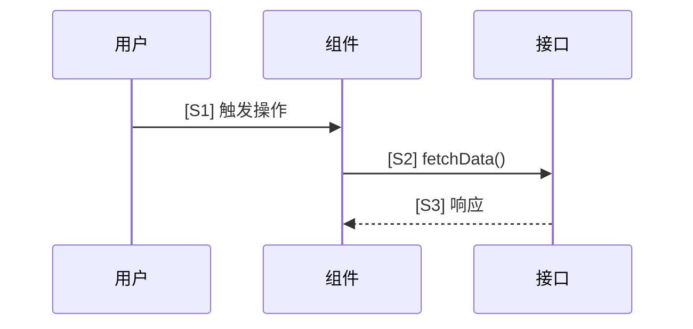
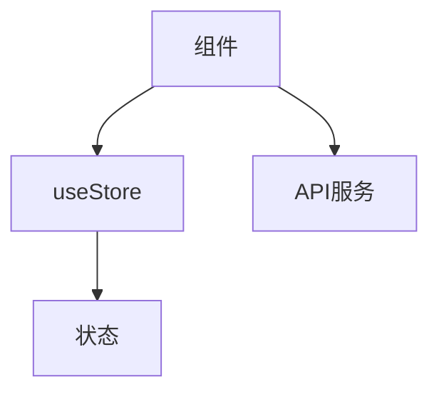
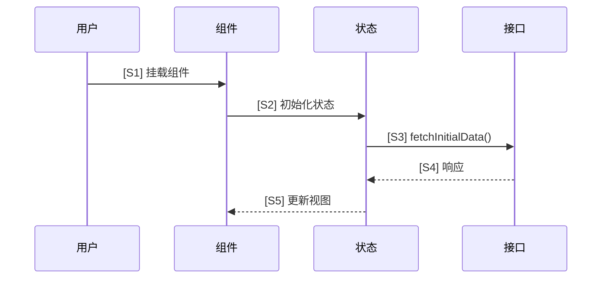
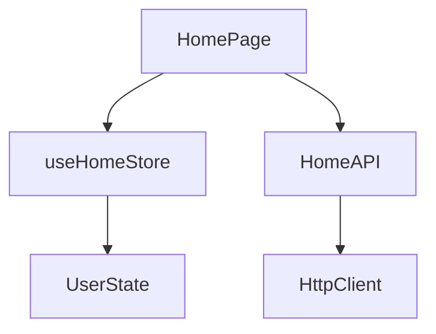
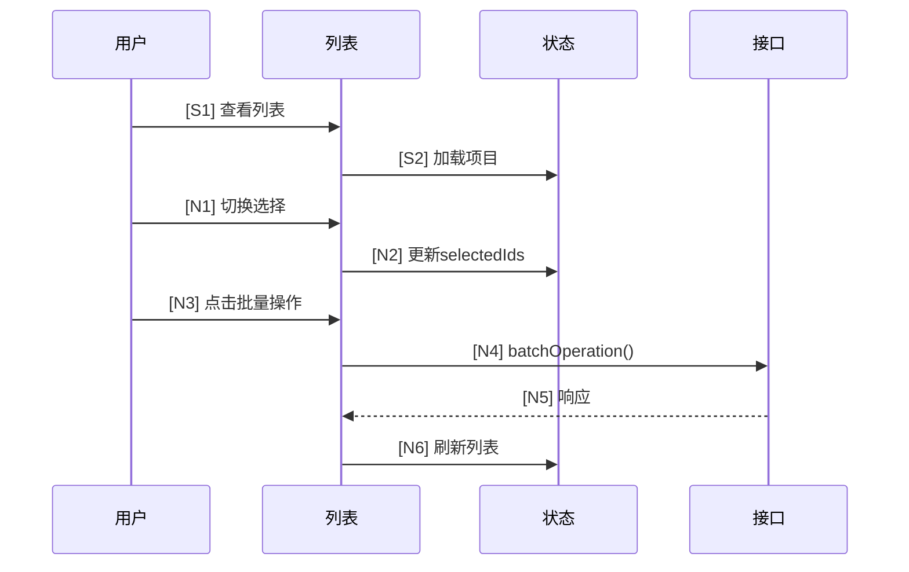
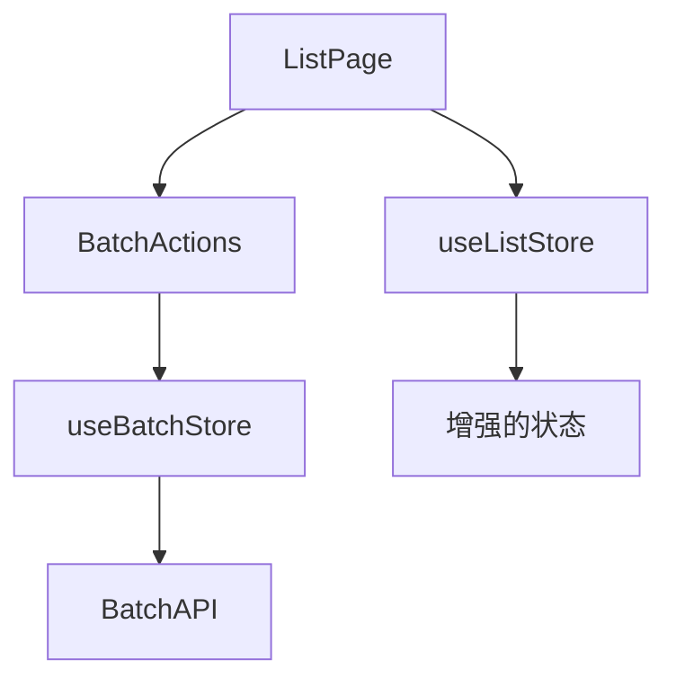

# IncSpec 使用指南

AI 编码助手使用 IncSpec 进行增量规格驱动开发的操作指南。

## 快速检查清单

**完整模式 (6步):**
- 初始化项目: `incspec init` (创建 `incspec/` 目录结构)
- 检查状态: `incspec status` 或 `incspec st`
- 按顺序执行6步工作流: analyze → collect-req → collect-dep → design → apply → merge
- 使用编号引用: `[S1]` 表示时序步骤, `[D1]` 表示依赖, `[C1]` 表示变更
- 标记增量: `[N1]` 新增, `[S1-Modified]` 修改, `[S1-Deleted]` 删除
- 继续前先验证: `incspec validate --strict`
- 合并后循环回到步骤1开始下一个增量周期

**快速模式 (3步):**
- 启动快速模式: `incspec analyze <path> --quick`
- 按顺序执行: analyze → collect-req → apply → merge
- 跳过步骤 3 (UI依赖采集) 和步骤 4 (增量设计)
- 适用于 Bug 修复、简单功能、不涉及复杂 UI 依赖的变更

## 六步工作流

### 概览

```
┌─────────────────────────────────────────────────────────────────────────┐
│                      IncSpec 工作流模式                                  │
├─────────────────────────────────────────────────────────────────────────┤
│                                                                         │
│   完整模式 (6步):                                                       │
│   ┌──────────┐    ┌──────────┐    ┌──────────┐                         │
│   │ 步骤 1   │    │ 步骤 2   │    │ 步骤 3   │                         │
│   │ 分析     │───▶│ 收集     │───▶│ 收集     │                         │
│   │ 代码流   │    │ 需求     │    │ UI依赖   │                         │
│   └──────────┘    └──────────┘    └──────────┘                         │
│        ▲                               │                                │
│        │                               ▼                                │
│   ┌──────────┐    ┌──────────┐    ┌──────────┐                         │
│   │ 步骤 6   │    │ 步骤 5   │    │ 步骤 4   │                         │
│   │ 合并到   │◀───│ 应用     │◀───│ 设计     │                         │
│   │ 基线     │    │ 代码     │    │ 增量     │                         │
│   └──────────┘    └──────────┘    └──────────┘                         │
│        │                                                                │
│        └──────────────── 循环回到步骤 1 ────────────────────────────▶  │
│                                                                         │
│   快速模式 (3步):                                                       │
│   ┌──────────┐    ┌──────────┐    ┌──────────┐    ┌──────────┐         │
│   │ 步骤 1   │    │ 步骤 2   │    │ 步骤 5   │    │ 步骤 6   │         │
│   │ 分析     │───▶│ 收集     │───▶│ 应用     │───▶│ 合并到   │         │
│   │ 代码流   │    │ 需求     │    │ 代码     │    │ 基线     │         │
│   └──────────┘    └──────────┘    └──────────┘    └──────────┘         │
│   (跳过步骤 3 UI依赖采集 和 步骤 4 增量设计)                            │
│                                                                         │
└─────────────────────────────────────────────────────────────────────────┘
```

**模式选择:**
- **完整模式**: 复杂 UI 功能、多组件交互、需要详细设计审查
- **快速模式**: Bug 修复、简单功能、不涉及 UI 依赖变更

### 步骤 1: 分析代码工作流

**命令**: `incspec analyze <source-path> [--module=name] [--quick] [--baseline=file]`

**目的**: 生成包含 API 调用时序图和依赖关系图的基线快照。

**选项**:
- `--quick`: 启动快速模式 (3步流程)
- `--baseline=<file>`: 使用现有基准报告，自动从 baselines/ 或 archives/ 目录恢复

**输出**: `incspec/baselines/{module}-baseline-v{n}.md`

**关键交付物**:
- 带编号步骤 `[S1]`, `[S2]`, `[S3]`... 的 Mermaid 时序图
- 带编号节点 `[D1]`, `[D2]`, `[D3]`... 的 Mermaid 依赖图
- 带关系分类 `[R1.1]`, `[R2.1]`, `[R3.1]`... 的依赖摘要

**输出结构示例**:
```markdown
## API 调用时序图



## 依赖关系图



## 依赖摘要

| ID | 关系类型 | 描述 |
|----|----------|------|
| R1.1 | 串行 | S1 → S2 → S3 |
| R2.1 | 并行 | S4 ∥ S5 |
| R3.1 | 条件 | S6 → S7 (满足条件时) |
```

### 步骤 2: 收集结构化需求

**命令**: `incspec collect-req` (别名: `cr`)

**目的**: 交互式需求收集,转换为严格的5列格式。

**输出**: `incspec/requirements/structured-requirements.md`

**5列表格格式**:

| 列名 | 描述 |
|------|------|
| 新增/修改功能 | 正在添加或更改的内容 |
| 涉及的UI组件 | 受影响的组件 |
| 触发条件 | 触发此功能的条件 |
| 核心状态变更 | Store/Props/Context 的变化 |
| 预期数据流 | 数据在系统中的流转方式 |

**交互模式**:
1. 从用户处收集初始需求
2. 通过澄清问题消除歧义
3. 转换为结构化5列格式
4. 最终确定前与用户确认

### 步骤 3: 收集 UI 依赖

**命令**: `incspec collect-dep` (别名: `cd`)

**目的**: 映射新增/修改 UI 组件的所有上下文依赖。

**输出**: `incspec/requirements/ui-dependencies.md`

**6个依赖维度**:

| 维度 | 示例 |
|------|------|
| UI组件库 | Arco Design, Antd, Element Plus |
| 状态管理 | Zustand, Pinia, Redux, MobX |
| API集成 | REST端点, GraphQL查询 |
| 类型定义 | Interfaces, types, enums |
| 工具函数 | Helpers, formatters, validators |
| 上下文/位置 | 文件路径, 父组件 |

### 步骤 4: 设计增量

**命令**: `incspec design [--feature=name]` (别名: `d`)

**目的**: 创建全面的增量设计蓝图。

**输出**: `incspec/increments/{feature}-increment-v{n}.md`

**7个主要模块**:

1. **一句话摘要** - 本次增量的核心目标
2. **变更链设计表** - `[C1]`, `[C2]`, `[C3]`... 及其逻辑规格
3. **规划的API调用时序图** - 原始 `[S]` + 新增 `[N]` + 修改 `[S-Modified]` + 删除 `[S-Deleted]`
4. **规划的依赖关系图** - 原始 `[D]` + 新增 `[N]` + 修改 `[D_MOD]` + 删除 `[D_DEL]`
5. **完整文件变更清单** - 操作类型 (create/modify/delete) 及精确路径
6. **潜在风险与副作用** - 关注点检查清单
7. **建议的测试用例** - 至少6个测试场景

**增量标记**:
- `[N1]`, `[N2]`... - 新增项
- `[S1-Modified]`, `[D2_MOD]` - 对现有项的修改
- `[S3-Deleted]`, `[D4_DEL]` - 删除项

### 步骤 5: 应用代码变更

**命令**: `incspec apply [increment-path]` (别名: `ap`)

**目的**: 根据增量蓝图执行代码生成和修改。

**处理流程**:
1. 解析增量蓝图 (模块2-5)
2. 分析依赖并进行拓扑排序
3. 执行顺序: Types → Utils → APIs → Store → Components
4. 使用项目风格参考创建新文件
5. 对现有文件进行精确编辑
6. 验证 TypeScript 编译
7. 输出变更摘要及统计信息

**审批门禁**: 在增量设计经过审查和批准之前,不要执行此步骤。

### 步骤 6: 合并到基线

**命令**: `incspec merge [increment-path]` (别名: `m`)

**目的**: 将增量整合到新的基线快照中。

**处理流程**:
1. 读取增量报告 (模块3-4)
2. 移除所有增量标记 (N/Modified/Deleted)
3. 将新节点与原始基线合并
4. 重新编号为干净的 `[S1]`-`[Sxx]` 和 `[D1]`-`[Dxx]` 序列
5. 输出新基线: `{module}-baseline-v{n+1}.md`

**结果**: 新基线成为下一个增量周期的起点。

## 任务前准备

**上下文检查清单**:
- [ ] 运行 `incspec status` 检查当前工作流状态
- [ ] 阅读 `incspec/project.md` 了解项目约定
- [ ] 查看 `incspec/baselines/` 中的最新基线
- [ ] 检查 `incspec/increments/` 中待处理的增量
- [ ] 运行 `incspec list` 查看所有规格文件

**创建新增量前**:
- 始终从最新基线开始
- 在开始新增量之前完成上一个增量
- 使用 `incspec validate` 检查完整性
- 严格按步骤顺序执行: 1 → 2 → 3 → 4 → 5 → 6

## 快速开始

### CLI 命令

```bash
# 初始化
incspec init                    # 交互式项目设置
incspec init --force            # 强制重新初始化

# 状态与导航
incspec status / st             # 查看当前工作流状态
incspec list / ls               # 列出所有规格文件
incspec list baselines          # 仅列出基线
incspec list -l                 # 长格式(含时间戳)
incspec list -a                 # 包含归档

# 6步工作流
incspec analyze <path> [--module=name] [--quick] [--baseline=file]  # 步骤1: 基线分析
incspec collect-req / cr                  # 步骤2: 需求收集
incspec collect-dep / cd                  # 步骤3: 依赖收集 (快速模式跳过)
incspec design [--feature=name] / d       # 步骤4: 增量设计 (快速模式跳过)
incspec apply [path] / ap                 # 步骤5: 代码执行
incspec merge [path] / m                  # 步骤6: 基线合并

# 验证与管理
incspec validate / v            # 验证完整性
incspec validate --strict       # 严格验证模式
incspec archive                 # 归档当前工作流全部产出文件
incspec archive --workflow      # 同上，显式指定
incspec archive <file>          # 归档指定文件
incspec archive <file> --keep   # 复制而非移动

# IDE 集成
incspec sync                    # 交互式选择同步目标
incspec sync --cursor           # 同步 Cursor 斜杠命令
incspec sync --claude           # 同步 Claude Code Skill
incspec sync --all              # 同步全部
incspec sync --global           # 同步到全局目录
incspec sync --project          # 同步到当前目录

# 帮助
incspec help [command]          # 显示帮助
incspec --version / -v          # 显示版本
```

### Cursor 斜杠命令

运行 `incspec sync --cursor` 后,以下命令可用:

| 命令 | 步骤 | 描述 |
|------|------|------|
| `/incspec/inc-analyze` | 1 | 分析代码流,生成基线 |
| `/incspec/inc-collect-req` | 2 | 收集结构化需求 |
| `/incspec/inc-collect-dep` | 3 | 收集UI依赖 |
| `/incspec/inc-design` | 4 | 设计增量蓝图 |
| `/incspec/inc-apply` | 5 | 应用代码变更 |
| `/incspec/inc-merge` | 6 | 合并到基线 |
| `/incspec/inc-status` | - | 检查工作流状态 |
| `/incspec/inc-help` | - | 显示帮助 |

## 目录结构

```
incspec/
├── project.md              # 项目配置 (名称、技术栈、源码目录)
├── WORKFLOW.md             # 工作流状态跟踪
├── AGENTS.md               # AI编码助手使用指南
├── baselines/              # 版本控制的基线快照
│   └── {module}-baseline-v{n}.md
├── requirements/           # 结构化需求与UI依赖
│   ├── structured-requirements.md
│   └── ui-dependencies.md
├── increments/             # 增量设计蓝图
│   └── {feature}-increment-v{n}.md
└── archives/               # 历史记录
    └── YYYY-MM/            # 按月份组织
        └── {module}/       # 按工作流模块分组
```

## 编号系统

### 时序编号

用于 Mermaid sequenceDiagram 中的 API 调用和状态变更:

| 格式 | 用途 | 示例 |
|------|------|------|
| `[S1]`, `[S2]`... | 原始基线步骤 | `[S1] 用户点击按钮` |
| `[N1]`, `[N2]`... | 增量中的新步骤 | `[N1] 验证输入` |
| `[S1-Modified]` | 修改的现有步骤 | `[S1-Modified] 增强验证` |
| `[S3-Deleted]` | 删除的步骤 | `[S3-Deleted] 移除遗留调用` |

### 依赖节点编号

用于 Mermaid graph 中的依赖关系:

| 格式 | 用途 | 示例 |
|------|------|------|
| `[D1]`, `[D2]`... | 原始基线节点 | `D1[UserStore]` |
| `[N1]`, `[N2]`... | 增量中的新节点 | `N1[ValidationUtil]` |
| `[D2_MOD]` | 修改的现有节点 | `D2_MOD[增强的API]` |
| `[D3_DEL]` | 删除的节点 | `D3_DEL[遗留服务]` |

### 变更链编号

用于增量设计表:

| 格式 | 用途 |
|------|------|
| `[C1]`, `[C2]`... | 顺序变更操作 |

### 关系编号

用于依赖摘要:

| 格式 | 分类 | 描述 |
|------|------|------|
| `[R1.x]` | 串行 | 顺序依赖 |
| `[R2.x]` | 并行 | 并发调用组 |
| `[R3.x]` | 条件 | 基于条件的依赖 |

## 文件格式

### 基线文件结构

```markdown
---
module: home
version: 1
created: 2024-01-15T10:00:00Z
source_path: src/pages/Home
---

# {Module} 基线 v{n}

## API 调用时序图



## 依赖关系图



## 依赖摘要

| ID | 类型 | 关系 | 描述 |
|----|------|------|------|
| R1.1 | 串行 | S1 → S2 → S3 | 挂载到获取序列 |
| R1.2 | 串行 | S3 → S4 → S5 | API响应流 |
| R2.1 | 并行 | D2 ∥ D3 | Store和API相互独立 |
```

### 增量文件结构

```markdown
---
feature: batch-operation
version: 1
baseline: home-baseline-v1
created: 2024-01-16T14:00:00Z
---

# {Feature} 增量 v{n}

## 1. 一句话摘要

为列表视图添加批量选择和批量操作功能。

## 2. 变更链设计表

| ID | 变更 | 文件 | 操作 | 逻辑规格 |
|----|------|------|------|----------|
| C1 | 添加选择状态 | store/list.ts | modify | 跟踪已选ID |
| C2 | 添加批量操作 | components/BatchActions.tsx | create | 批量操作UI |
| C3 | 添加批量API | api/batch.ts | create | 批量操作端点 |

## 3. 规划的API调用时序图



## 4. 规划的依赖关系图



## 5. 完整文件变更清单

| 操作 | 路径 | 描述 |
|------|------|------|
| create | src/components/BatchActions.tsx | 批量操作按钮 |
| create | src/api/batch.ts | 批量API服务 |
| create | src/store/batch.ts | 批量选择状态 |
| modify | src/store/list.ts | 添加选择跟踪 |
| modify | src/pages/List.tsx | 集成批量UI |

## 6. 潜在风险与副作用

- [ ] 性能: 大量选择可能导致渲染变慢
- [ ] 状态同步: 批量操作后需清除选择状态
- [ ] 错误处理: 部分批量失败需要优雅处理
- [ ] 用户体验: 批量操作期间的加载状态

## 7. 建议的测试用例

| # | 测试用例 | 预期结果 |
|---|----------|----------|
| 1 | 选择单个项目 | 项目高亮,计数显示1 |
| 2 | 选择全部项目 | 所有项目高亮 |
| 3 | 取消选择项目 | 项目取消高亮,计数递减 |
| 4 | 执行批量删除 | 已选项目被移除 |
| 5 | 批量操作失败 | 显示错误消息,项目保留 |
| 6 | 取消选择 | 所有项目取消选择 |
```

### 需求文件结构

```markdown
---
created: 2024-01-16T10:00:00Z
updated: 2024-01-16T14:30:00Z
---

# 结构化需求

## 功能需求

| 功能 | UI组件 | 触发条件 | 状态变更 | 数据流 |
|------|--------|----------|----------|--------|
| 批量删除 | List, BatchActions | 点击删除按钮 | selectedIds → clear | 用户 → Store → API → 刷新 |
| 批量导出 | List, ExportModal | 点击导出按钮 | exportFormat | 用户 → Store → API → 下载 |

## 澄清问题

- 问: 批量操作的最大数量是多少?
- 答: 每次操作100项

- 问: 删除的项目是否可恢复?
- 答: 否,此功能接受硬删除
```

## 最佳实践

### 工作流纪律

1. **不要跳过步骤** - 每个步骤都建立在前一步的基础上
2. **一次一个增量** - 完成后再开始下一个
3. **频繁验证** - 继续前运行 `incspec validate`
4. **保持基线最新** - 实施成功后始终合并

### 编号一致性

1. **使用连续编号** - 序列中不能有间隙
2. **适当使用前缀** - S表示时序, D表示依赖, C表示变更
3. **清晰标记修改** - 始终标注Modified/Deleted
4. **合并时重新编号** - 基线中保持干净序列

### 文档质量

1. **具体明确** - 精确的文件路径、函数名、类型
2. **包含示例** - 清单中的代码片段
3. **列出所有风险** - 即使是小问题
4. **全面测试** - 覆盖边界情况

### 代码生成安全

1. **应用前审查** - 始终审查增量设计
2. **变更前备份** - 先提交当前状态
3. **验证TypeScript** - 确保编译通过
4. **增量测试** - 每次变更后运行测试

## 故障排除

### 常见错误

**"Workflow not initialized"**
- 运行 `incspec init` 设置项目
- 检查 `incspec/` 目录是否存在

**"No baseline found"**
- 先完成步骤1 (analyze)
- 检查 `incspec/baselines/` 目录

**"Previous step not completed"**
- 运行 `incspec status` 检查进度
- 按顺序完成待处理步骤

**"Validation failed"**
- 检查文件格式是否符合预期结构
- 确保所有必需部分都存在
- 验证编号序列

### 验证技巧

```bash
# 检查整体完整性
incspec validate --strict

# 列出文件以验证结构
incspec list -l

# 检查当前状态
incspec status
```

### 恢复步骤

1. **工作流卡住**: 删除 `WORKFLOW.md` 并重新开始
2. **基线损坏**: 从 `archives/` 恢复或重新生成
3. **合并失败**: 使用最新基线重新运行合并

## 快速参考

### 工作流状态

| 状态 | 描述 |
|------|------|
| `pending` | 步骤未开始 |
| `in_progress` | 步骤正在进行 |
| `completed` | 步骤已完成 |

### 文件类型

| 目录 | 用途 | 版本控制 |
|------|------|----------|
| `baselines/` | 当前真相 | 是 (v1, v2...) |
| `requirements/` | 收集的规格 | 否 |
| `increments/` | 变更提案 | 是 (v1, v2...) |
| `archives/` | 历史记录 | 按日期 |

### CLI 快捷方式

| 完整命令 | 别名 | 描述 |
|----------|------|------|
| `status` | `st` | 查看状态 |
| `collect-req` | `cr` | 需求收集 |
| `collect-dep` | `cd` | 依赖收集 |
| `design` | `d` | 设计 |
| `apply` | `ap` | 应用 |
| `merge` | `m` | 合并 |
| `list` | `ls` | 列出文件 |
| `validate` | `v` | 验证 |

### 常用命令

```bash
incspec status              # 我在哪里?
incspec list               # 有什么?
incspec validate --strict  # 是否正确?
incspec sync               # 设置IDE命令
```

## 与AI助手集成

### 推荐工作流

1. **人类**: 提供高层需求
2. **AI**: 运行步骤1 (analyze) 理解代码库
3. **AI**: 运行步骤2 (collect-req) 并提出澄清问题
4. **AI**: 运行步骤3 (collect-dep) 映射依赖
5. **AI**: 运行步骤4 (design) 创建蓝图
6. **人类**: 审查并批准增量设计
7. **AI**: 运行步骤5 (apply) 生成代码
8. **人类**: 测试并验证变更
9. **AI**: 运行步骤6 (merge) 更新基线
10. **循环**: 返回步骤1开始下一个增量

### 核心原则

- **增量优于大爆炸** - 小的、经过验证的变更
- **规格驱动** - 需求先于代码
- **可追溯** - 每个变更都关联到需求
- **可逆转** - 基线提供回滚点

记住: 基线是真相。增量是提案。通过6步周期保持它们同步。
