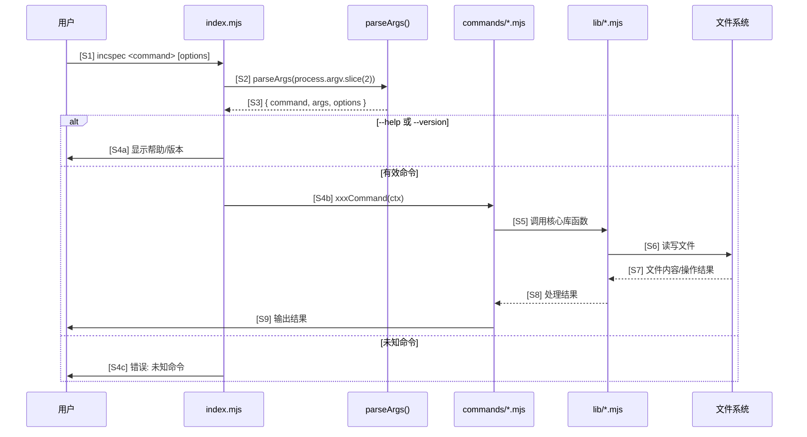
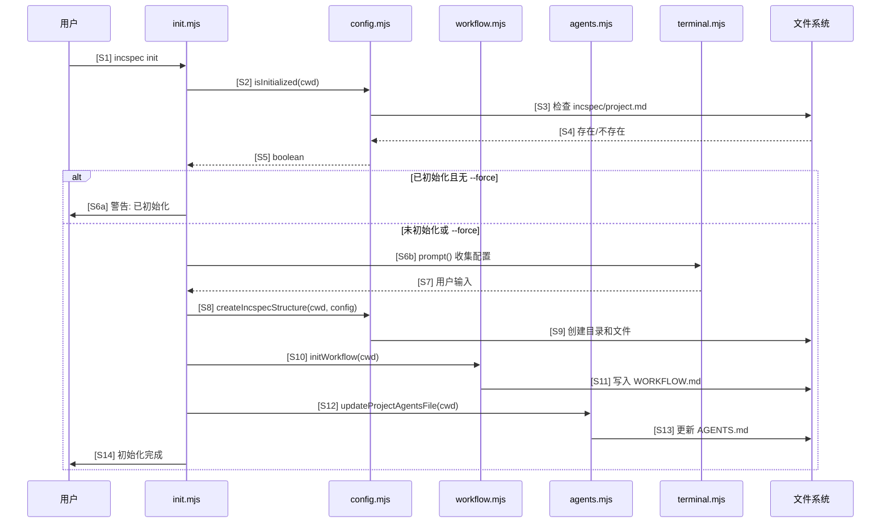
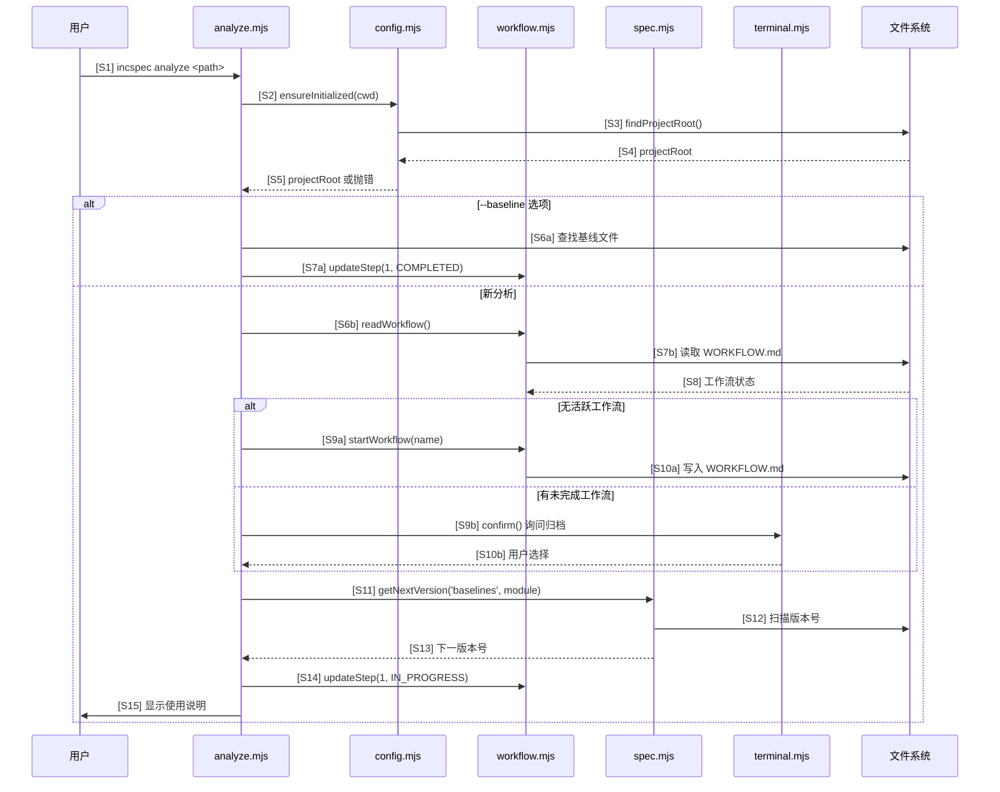
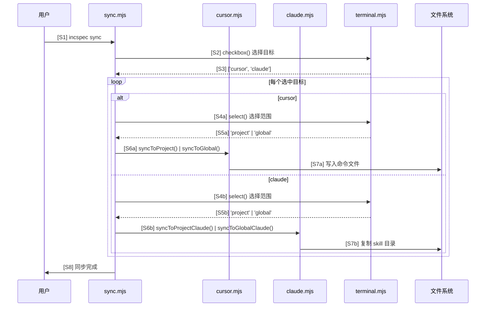
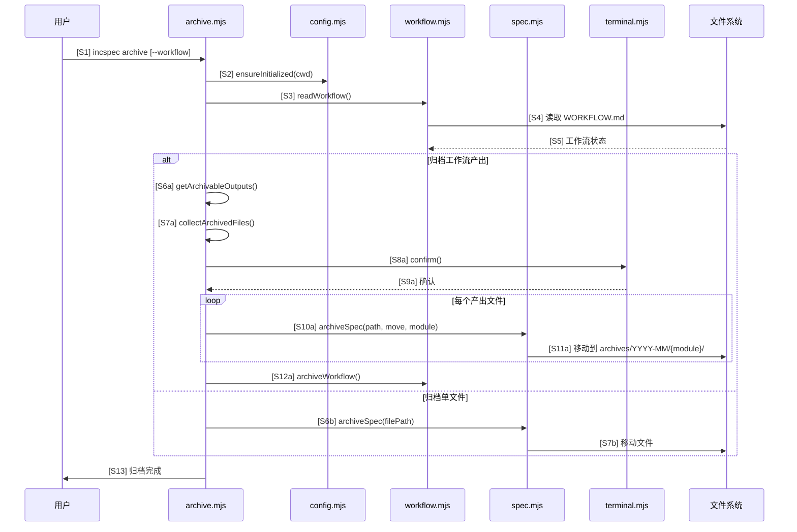
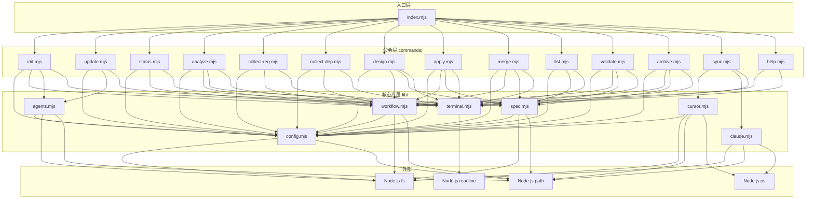
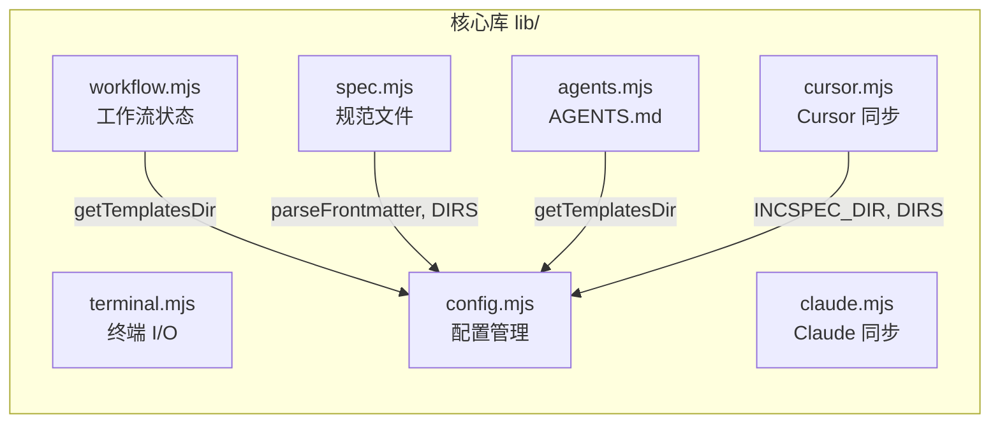

# IncSpec CLI 代码流程基线报告

> 生成时间: 2025-12-20
> 分析范围: 完整项目 (index.mjs, commands/, lib/)
> 版本: v1

## 1. 一句话摘要

IncSpec 是一个纯 ES Modules 的 CLI 工具，通过 `index.mjs` 入口解析命令行参数并路由到 14 个命令模块，命令模块依赖 7 个核心库实现配置管理、工作流状态、规范文件操作和终端交互。

---

## 2. 模块调用时序图

### 2.1 CLI 启动与命令路由时序



### 2.2 init 命令时序



### 2.3 工作流命令时序 (以 analyze 为例)



### 2.4 sync 命令时序



### 2.5 archive 命令时序



---

## 3. 依赖关系图

### 3.1 模块层级依赖



### 3.2 核心库内部依赖



### 3.3 命令-库依赖矩阵

| 命令 | config | workflow | spec | terminal | agents | cursor | claude |
|------|:------:|:--------:|:----:|:--------:|:------:|:------:|:------:|
| init | * | * | - | * | * | - | - |
| update | * | - | - | * | * | - | - |
| status | * | * | - | * | - | - | - |
| analyze | * | * | * | * | - | - | - |
| collect-req | * | * | - | * | - | - | - |
| collect-dep | * | * | - | * | - | - | - |
| design | * | * | * | * | - | - | - |
| apply | * | * | * | * | - | - | - |
| merge | * | * | * | * | - | - | - |
| list | * | - | * | * | - | - | - |
| validate | * | * | * | * | - | - | - |
| archive | * | * | * | * | - | - | - |
| sync | - | - | - | * | - | * | * |
| help | - | * | - | * | - | - | - |

---

## 4. 数据流摘要

### 4.1 工作流状态流转

```
┌─────────────────────────────────────────────────────────────────┐
│                        工作流生命周期                            │
├─────────────────────────────────────────────────────────────────┤
│                                                                 │
│  [无工作流] ──startWorkflow()──► [活跃工作流]                    │
│       ▲                              │                          │
│       │                              │                          │
│       │                              ▼                          │
│       │                    ┌─────────────────┐                  │
│       │                    │ Step 1: analyze │                  │
│       │                    │   PENDING       │                  │
│       │                    │   IN_PROGRESS   │                  │
│       │                    │   COMPLETED ────┼──► 输出: baseline│
│       │                    └────────┬────────┘                  │
│       │                             │ updateStep()              │
│       │                             ▼                           │
│       │                    ┌─────────────────┐                  │
│       │                    │ Step 2-6: ...   │                  │
│       │                    │   (同上)        │                  │
│       │                    └────────┬────────┘                  │
│       │                             │                           │
│       │                             ▼                           │
│       └──archiveWorkflow()── [归档到历史]                        │
│                                                                 │
└─────────────────────────────────────────────────────────────────┘
```

### 4.2 文件产出路径

| 步骤 | 命令 | 输出文件 | 存储路径 |
|------|------|----------|----------|
| 1 | analyze | `{module}-baseline-v{n}.md` | `incspec/baselines/` |
| 2 | collect-req | `structured-requirements.md` | `incspec/requirements/` |
| 3 | collect-dep | `ui-dependencies.md` | `incspec/requirements/` |
| 4 | design | `{feature}-increment-v{n}.md` | `incspec/increments/` |
| 5 | apply | (代码变更) | (源代码目录) |
| 6 | merge | `{module}-baseline-v{n+1}.md` | `incspec/baselines/` |
| - | archive | 移动文件 | `incspec/archives/YYYY-MM/{module}/` |

### 4.3 配置数据流

```
project.md (YAML frontmatter)
    │
    ├── name: 项目名称
    ├── version: 版本号
    ├── tech_stack: 技术栈数组
    ├── source_dir: 源代码目录
    └── created_at: 创建日期
         │
         ▼
    readProjectConfig() ──► { name, version, tech_stack, source_dir, ... }
         │
         ├──► statusCommand() 显示项目信息
         ├──► applyCommand() 获取 source_dir
         └──► validate() 检查配置完整性
```

---

## 5. 关键函数索引

### 5.1 config.mjs

| 函数 | 行号 | 用途 |
|------|------|------|
| `findProjectRoot(startDir)` | 38-52 | 向上查找 incspec/ 目录 |
| `isInitialized(cwd)` | 64-68 | 检查是否已初始化 |
| `ensureInitialized(cwd)` | 192-200 | 确保已初始化，否则抛错 |
| `parseFrontmatter(content)` | 73-109 | 解析 YAML frontmatter |
| `readProjectConfig(projectRoot)` | 126-139 | 读取项目配置 |
| `createIncspecStructure(projectRoot, config)` | 173-190 | 创建目录结构 |
| `getTemplatesDir()` | 28-34 | 获取模板目录路径 |

### 5.2 workflow.mjs

| 函数 | 行号 | 用途 |
|------|------|------|
| `readWorkflow(projectRoot)` | 118-128 | 读取工作流状态 |
| `writeWorkflow(projectRoot, workflow)` | 169-173 | 写入工作流状态 |
| `startWorkflow(projectRoot, name)` | 195-223 | 创建新工作流 |
| `updateStep(projectRoot, stepNumber, status, output)` | 229-254 | 更新步骤状态 |
| `archiveWorkflow(projectRoot)` | 274-294 | 归档当前工作流 |
| `getWorkflowProgress(workflow)` | 315-332 | 计算完成进度 |
| `parseWorkflow(content)` | 71-116 | 解析 WORKFLOW.md |

### 5.3 spec.mjs

| 函数 | 行号 | 用途 |
|------|------|------|
| `listSpecs(projectRoot, type)` | 29-48 | 列出规范文件 |
| `getNextVersion(projectRoot, type, prefix)` | 54-68 | 计算下一版本号 |
| `getLatestSpec(projectRoot, type, prefix)` | 74-90 | 获取最新版本文件 |
| `archiveSpec(projectRoot, filePath, deleteOriginal, module)` | 140-167 | 归档规范文件 |
| `readSpec(filePath)` | 125-135 | 读取规范文件内容 |
| `getSpecInfo(filePath)` | 172-206 | 解析文件信息 |

### 5.4 terminal.mjs

| 函数 | 行号 | 用途 |
|------|------|------|
| `colorize(text, ...colors)` | 32-34 | 应用 ANSI 颜色 |
| `print(text, ...colors)` | 40-46 | 打印彩色文本 |
| `prompt(message, defaultValue)` | 90-102 | 文本输入提示 |
| `confirm(message)` | 76-86 | 确认提示 (y/N) |
| `select({ message, choices })` | 108-156 | 单选交互 |
| `checkbox({ message, choices })` | 162-218 | 多选交互 |
| `printStep(step, name, status)` | 69-79 | 打印步骤状态 |

---

## 6. 技术约束

1. **纯 ES Modules**: 所有文件使用 `.mjs` 扩展名，import/export 语法
2. **零第三方依赖**: 仅使用 Node.js 内置模块 (fs, path, readline, os)
3. **无构建步骤**: 直接运行，无需编译或打包
4. **同步文件操作**: 所有文件 I/O 使用同步 API (`fs.*Sync`)
5. **终端交互**: 使用 `readline` 实现交互式提示，支持 ANSI 颜色和光标控制

---

## 7. 备注

- 工作流步骤 2-6 的实际代码生成/修改工作由外部 AI 编码助手完成
- CLI 工具主要负责状态管理、文件组织和用户交互
- `sync` 命令将模板同步到 Cursor/Claude，使 AI 助手能识别 incspec 工作流
