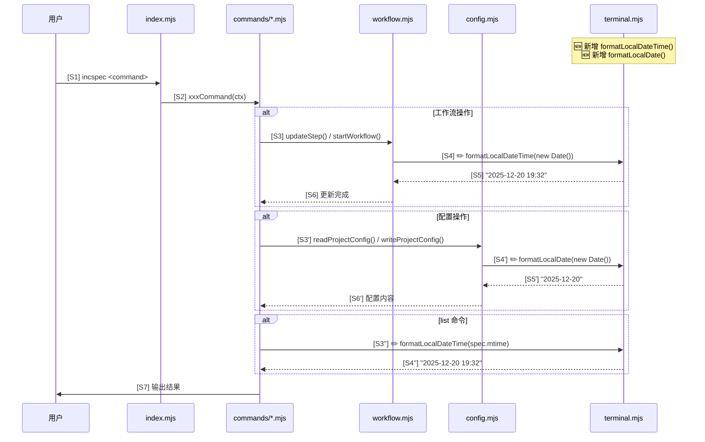
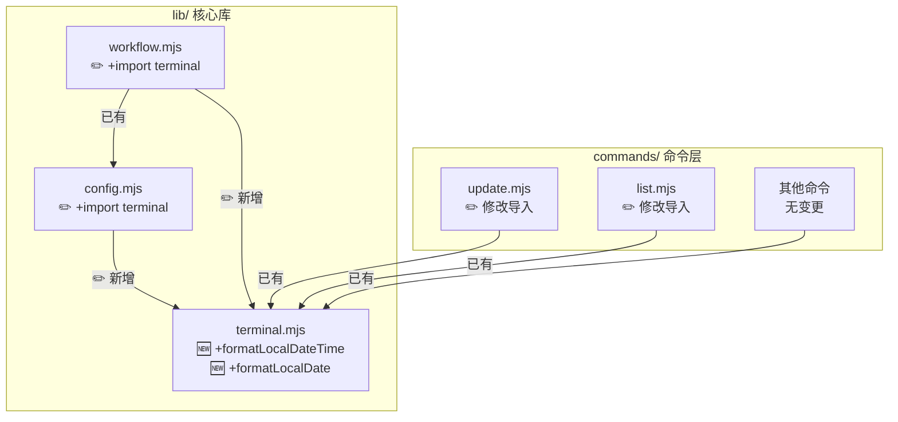

# 增量设计蓝图

> 工作流: analyze-incspec-cli
> 功能: fix-local-time
> 创建时间: 2025-12-20
> 版本: v1

---

## 模块1: 一句话摘要

在 `lib/terminal.mjs` 新增 `formatLocalDateTime()` 和 `formatLocalDate()` 两个本地时间格式化函数，替换项目中 11 处使用 `toISOString()` 生成 UTC 时间的代码，修复时间显示偏差问题。

---

## 模块2: 变更链条设计表

| 序号 | 变更项 | 变更类型 | 文件路径 | 依赖前置 | 风险等级 |
|------|--------|----------|----------|----------|----------|
| C1 | 新增 `formatLocalDateTime` 函数 | 新增 | `lib/terminal.mjs` | 无 | 低 |
| C2 | 新增 `formatLocalDate` 函数 | 新增 | `lib/terminal.mjs` | 无 | 低 |
| C3 | 新增导入 `formatLocalDateTime` | 修改 | `lib/workflow.mjs` | C1 | 低 |
| C4 | 替换 7 处时间生成代码 | 修改 | `lib/workflow.mjs` | C3 | 中 |
| C5 | 新增导入 `formatLocalDate` | 修改 | `lib/config.mjs` | C2 | 低 |
| C6 | 替换 2 处日期生成代码 | 修改 | `lib/config.mjs` | C5 | 低 |
| C7 | 修改导入添加 `formatLocalDateTime` | 修改 | `commands/update.mjs` | C1 | 低 |
| C8 | 替换 1 处时间生成代码 | 修改 | `commands/update.mjs` | C7 | 低 |
| C9 | 修改导入添加 `formatLocalDateTime` | 修改 | `commands/list.mjs` | C1 | 低 |
| C10 | 替换 1 处时间生成代码 | 修改 | `commands/list.mjs` | C9 | 低 |

**执行顺序**: C1 → C2 → C3 → C4 → C5 → C6 → C7 → C8 → C9 → C10

---

## 模块3: 修改后的模块调用时序图



**图例**: 🆕 新增 | ✏️ 修改 | ❌ 删除

---

## 模块4: 修改后的依赖关系图



---

## 模块5: 文件清单

### 5.1 文件操作汇总

| 文件路径 | 操作类型 | 修改行数 | 说明 |
|----------|----------|----------|------|
| `lib/terminal.mjs` | ✏️ 修改 | +25 行 | 新增 2 个函数 |
| `lib/workflow.mjs` | ✏️ 修改 | +1, ~7 行 | 新增导入 + 替换 7 处 |
| `lib/config.mjs` | ✏️ 修改 | +1, ~2 行 | 新增导入 + 替换 2 处 |
| `commands/update.mjs` | ✏️ 修改 | ~2 行 | 修改导入 + 替换 1 处 |
| `commands/list.mjs` | ✏️ 修改 | ~2 行 | 修改导入 + 替换 1 处 |

**汇总**: 5 个文件修改，0 个新增，0 个删除

### 5.2 详细变更规格

#### 5.2.1 lib/terminal.mjs (新增函数)

**位置**: 文件末尾 (约 375 行后)

```javascript
// 🆕 新增代码块
/**
 * 格式化为本地日期时间字符串
 * @param {Date} date - 日期对象
 * @returns {string} 格式: YYYY-MM-DD HH:mm
 */
export function formatLocalDateTime(date) {
  const year = date.getFullYear();
  const month = String(date.getMonth() + 1).padStart(2, '0');
  const day = String(date.getDate()).padStart(2, '0');
  const hours = String(date.getHours()).padStart(2, '0');
  const minutes = String(date.getMinutes()).padStart(2, '0');
  return `${year}-${month}-${day} ${hours}:${minutes}`;
}

/**
 * 格式化为本地日期字符串
 * @param {Date} date - 日期对象
 * @returns {string} 格式: YYYY-MM-DD
 */
export function formatLocalDate(date) {
  const year = date.getFullYear();
  const month = String(date.getMonth() + 1).padStart(2, '0');
  const day = String(date.getDate()).padStart(2, '0');
  return `${year}-${month}-${day}`;
}
```

#### 5.2.2 lib/workflow.mjs (导入 + 替换)

**导入变更** (行 10 后新增):
```javascript
// ✏️ 新增导入
import { formatLocalDateTime } from './terminal.mjs';
```

**代码替换** (7 处):

| 行号 | 原代码 | 新代码 |
|------|--------|--------|
| 214 | `const now = new Date().toISOString().replace('T', ' ').slice(0, 16);` | `const now = formatLocalDateTime(new Date());` |
| 295 | 同上 | 同上 |
| 327 | 同上 | 同上 |
| 384 | 同上 | 同上 |
| 414 | 同上 | 同上 |
| 443 | 同上 | 同上 |
| 552 | 同上 | 同上 |

#### 5.2.3 lib/config.mjs (导入 + 替换)

**导入变更** (行 10 后新增):
```javascript
// ✏️ 新增导入
import { formatLocalDate } from './terminal.mjs';
```

**代码替换** (2 处):

| 行号 | 原代码 | 新代码 |
|------|--------|--------|
| 210 | `config.created_at \|\| new Date().toISOString().split('T')[0]` | `config.created_at \|\| formatLocalDate(new Date())` |
| 239 | `const now = new Date().toISOString().split('T')[0];` | `const now = formatLocalDate(new Date());` |

#### 5.2.4 commands/update.mjs (修改导入 + 替换)

**导入变更** (行 16-23):
```javascript
// ✏️ 修改: 在现有导入中添加 formatLocalDateTime
import {
  colors,
  colorize,
  print,
  printSuccess,
  printWarning,
  printInfo,
  confirm,
  formatLocalDateTime,  // 🆕 新增
} from '../lib/terminal.mjs';
```

**代码替换** (1 处):

| 行号 | 原代码 | 新代码 |
|------|--------|--------|
| 74 | `const now = new Date().toISOString().replace('T', ' ').slice(0, 16);` | `const now = formatLocalDateTime(new Date());` |

#### 5.2.5 commands/list.mjs (修改导入 + 替换)

**导入变更** (行 12-18):
```javascript
// ✏️ 修改: 在现有导入中添加 formatLocalDateTime
import {
  colors,
  colorize,
  print,
  printTable,
  printWarning,
  formatLocalDateTime,  // 🆕 新增
} from '../lib/terminal.mjs';
```

**代码替换** (1 处):

| 行号 | 原代码 | 新代码 |
|------|--------|--------|
| 50 | `const mtime = spec.mtime.toISOString().replace('T', ' ').slice(0, 16);` | `const mtime = formatLocalDateTime(spec.mtime);` |

---

## 模块6: 风险预警

| 风险项 | 等级 | 描述 | 缓解措施 |
|--------|------|------|----------|
| 时区兼容性 | 低 | 不同时区显示不同时间 | 预期行为，本地时间符合用户预期 |
| 格式一致性 | 低 | 确保输出格式与原格式完全一致 | `padStart(2, '0')` 保证两位数 |
| 历史数据 | 低 | 已有 WORKFLOW.md 中的时间仍为 UTC | 向后兼容，不影响解析 |
| 循环依赖 | 无 | terminal.mjs 不导入其他项目模块 | 已验证无风险 |

---

## 模块7: 分步实现指导

### Step 1: 在 terminal.mjs 新增工具函数

1. 打开 `lib/terminal.mjs`
2. 在文件末尾 (`spinner` 函数后) 添加 `formatLocalDateTime` 和 `formatLocalDate` 函数
3. 确保函数已 `export`

### Step 2: 修改 workflow.mjs

1. 在导入区域新增: `import { formatLocalDateTime } from './terminal.mjs';`
2. 搜索 `toISOString().replace('T', ' ').slice(0, 16)`
3. 将 7 处匹配替换为 `formatLocalDateTime(new Date())`

### Step 3: 修改 config.mjs

1. 在导入区域新增: `import { formatLocalDate } from './terminal.mjs';`
2. 搜索 `toISOString().split('T')[0]`
3. 将 2 处匹配替换为 `formatLocalDate(new Date())`

### Step 4: 修改 commands/update.mjs

1. 在现有 `../lib/terminal.mjs` 导入中添加 `formatLocalDateTime`
2. 将第 74 行替换为 `const now = formatLocalDateTime(new Date());`

### Step 5: 修改 commands/list.mjs

1. 在现有 `../lib/terminal.mjs` 导入中添加 `formatLocalDateTime`
2. 将第 50 行替换为 `const mtime = formatLocalDateTime(spec.mtime);`

### Step 6: 验证

1. 运行 `node index.mjs status` 确认时间正确
2. 运行 `node index.mjs list -l` 确认文件时间正确
3. 执行一个工作流步骤，检查 `incspec/WORKFLOW.md` 中的时间

---

## 审批确认

- [ ] 设计方案已审阅
- [ ] 变更范围可接受
- [ ] 风险等级可接受
- [ ] 准备进入 Step 5 代码应用
